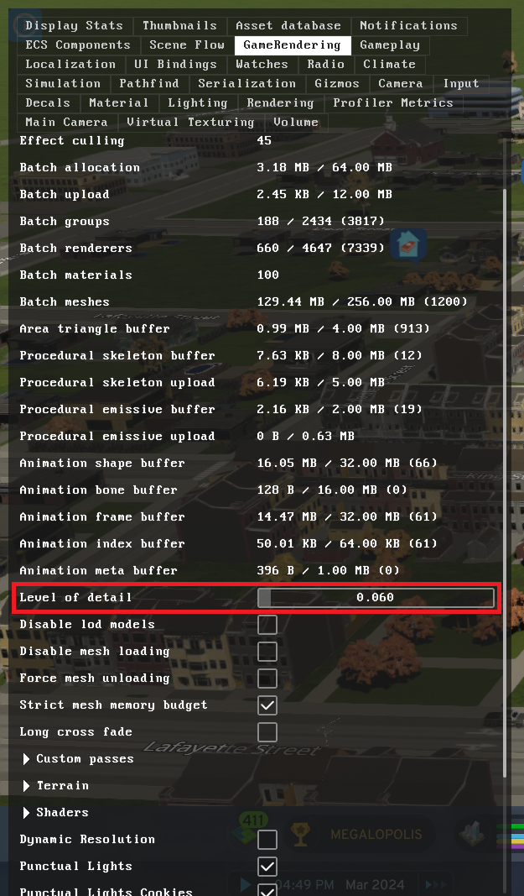

# Cities Skylines 2 Modding Repository

Welcome to the unofficial modding guide and repository for Cities Skylines 2. Since Colossal Order has yet to release official modding tools and documentation for the game, we have taken the initiative to help the community get started with modding. This README provides guidance and references on setting up the environment and using essential tools.

## Table of Contents
1. [BepInEx 6](#bepinex-6)
2. [HarmonyX](#harmonyx)
3. [Unity Version & Libraries](#unity-version--libraries)

## BepInEx 6
[BepInEx](https://github.com/BepInEx/BepInEx) is a universal Unity plugin framework which aims to provide a unified overlayed environment for different Unity games. It allows for runtime code modifications and has been widely used in modding various games.

### Setup:
1. Head over to the official [BepInEx GitHub repository](https://github.com/BepInEx/BepInEx).
2. Download the latest version that is compatible with Cities Skylines 2 (Use the Mono version).
3. Extract the contents to the root directory of Cities Skylines 2.
4. Run the game once to ensure that BepInEx initializes and creates its config folder.

## HarmonyX
[HarmonyX](https://github.com/BepInEx/HarmonyX) is a library developed for patching, replacing and decorating .NET and Mono methods during runtime. In the context of Cities Skylines 2, it helps in modifying the behavior of existing game functions.

### Setup:
1. Navigate to the [HarmonyX GitHub repository](https://github.com/BepInEx/HarmonyX).
2. Download the latest version for .NET Standard 2.1.
3. Extract and place it in the BepInEx/plugins folder inside your Cities Skylines 2 directory.
4. Make sure to reference the library when you're creating mods that require method patching.

## Unity Version & Libraries
Cities Skylines 2 is developed using Unity version `2022.3.7f1`. In order to mod the game, it's essential to have the appropriate unstripped libraries which provide detailed information about Unity classes and methods. It uses .NET Standard 2.1 version of the Mono runtime.

### Setup:
1. Download the unstripped libraries for Unity `2022.3.7f1` from this [link](https://unity.bepinex.dev/libraries/2022.3.7.zip).
2. Extract the zip file.
3. Place the extracted libraries in a known location. You'll reference them while developing mods.
4. When creating mods or tools, ensure you reference these libraries for proper IntelliSense and method details.
5. Ensure you set Copy to Local to no, you never want to include any libraries the game already is loading.
6. Include the Colossal Order Cities Skylines 2 game libraries located in <Game Folder>/Cities2_Data/Managed. Game.dll is the core Cities Skylines 2 game code, you'll need that along with the CO dlls. Again ensure copy to local is set to no.

### Example Mod:
I have provided an example mod with this configuration, it will need BepInEx 6 setup in the game folder, enable the console window in BepInEx config settings. You will need Visual Studio 2022.

1. Ensure the Cities `Cities2_Location` variable is set appropriately in your Visual Studio project so files can copy on build.

**Contribution & Feedback:** We highly appreciate community contributions. Feel free to submit pull requests, create issues, or provide feedback to make this modding guide more comprehensive and user-friendly.

**Disclaimer:** This modding guide and tools are provided "as is" without warranty of any kind. Modding can be risky, always remember to backup your game files before making modifications.

### Developer/Debug Menu:
In the example mod it forces the developer/debug menu to show, by pressing TAB in the game you can show the menu; which provides lots of useful information:

**Performance Tip:** I have found that the dev menu has a Level of Detail control which allows you to lower the detail further than the default menus would allow, this may make draw distance a lot lower but you can further fine tune performance. I've been able to gain a lot of frames by adjusting this to a value I'm happy with.

